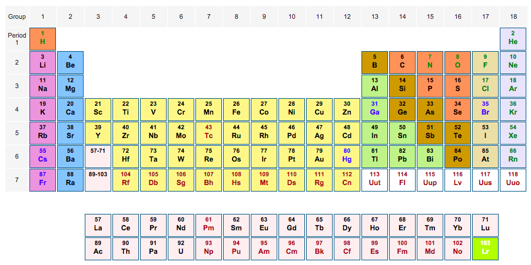

-----

## Getting started with HTML Tables and HTML content

The purpose of this lab is to get you started with Data from the web.

```{r}
# required packages
library(XML)
library(stringr)
```

-----

### Reading HTML tables

Let's visit the webpage:
[http://www.chemicool.com/](http://www.chemicool.com/)

The goal is to read the periodic table like the one in the screenshot below:



### First let's see the page HTML source

- Right click (mouse or trackpad) and select _View Page Source_
- Look for the `<table>` tag
- The table we are looking for starts around line 39


### Read HTML Table

The first step is to define the url of the html document. Then we can pass it to the function `readHTMLTable()`:
```{r}
# url of the html document
url <- 'http://www.chemicool.com/'

# raw html table
rawpt <- readHTMLTable(url, which = 1, stringsAsFactors = FALSE)
```
Notice that we're using `which = 1` to indicate that we want the first table of the html document. Also notice the use of `stringsAsFactors = FALSE`.


Now let's inspect some cells
```{r}
rawpt[1,1]
rawpt[2,1]
rawpt[1:4,1:3]
```

Let's get rid of the first column of the raw table:
```{r}
pt <- rawpt[ ,-1]
```

Let's check the first cell
```{r}
pt[1,1]
```

As you can tell, the cells contain the number and the symbol for each chemical element. 

-----

### Building a data frame

Let's build our own data frame with the number and symbol for each chemical element. That is, we want a data frame that looks like this:

| symbol  | number |
| ------- | ------ |
|    H    |    1   |
|    He   |    2   |
|    Li   |    3   |
|    Be   |    4   |
|  _etc_  |  _etc_ |  

(the first column is the `symbol`, and the second column is the `number`)

Write a __for__ loop that iterates through every cell of the table, and extarct both the number and symbol of each element. The goal is to get the symbols in a vector `esymbols`, and the numbers on a vector `enumbers`

```{r}
# empty vectors to store number and symbol
enumbers <- numeric(0)
esymbols <- character(0)

# auxiliar index
index <- 1

# loop over each cell of the periodic table
# to get the symbols and numbers


# ---
```


-----

### Full name of chemical elements

If you inspect the source-code you'll see that the table cells also have the complete name of a chemical element as well as an accompanying link of the form:
`http://www.chemicool.com/elements/hydrogen.html`

We can try to get those names using some regex. For this, instead of working with the HTML table, we'll read the contents as character strings with `readLines()`
```{r}
chemi <- readLines('http://www.chemicool.com/')
```
  
Let's inspect hydrogen in line 63
```{r}
# inspecting html element hydrogen (line 63)
chemi[63]
```

We could extract the name information like this:
```{r}
# getting html link
hydrogen_html <- str_extract(chemi[63], 'http://www.chemicool.com/elements/.*.html')
# extracting name and extension
hydrogen_html <- str_extract(hydrogen_html, '\\w+.html$')
# removing extension .html
hydrogen_html <- str_replace(hydrogen_html, '.html$', '')
hydrogen_html
```

Let's put it in function form:
```{r}
elem_name <- function(str) {
  str_html <- str_extract(str, '\\w+.html$')
  str_replace(str_html, '.html$', '')
}
```

Now let's do it for all chemical elements:
```{r}
pattern <- 'http://www.chemicool.com/elements/.*.html'
elems <- str_extract(chemi, pattern)
# remove missing values
elems <- elems[!is.na(elems)]
elem_names <- unlist(lapply(elems, elem_name))
```

The elements that we want are those from 1 to 118.

As you can tell, sometimes extracting information form HTML with just regular expressions can be a bit challenging.

----- 

### Your turn

Visit Yoda's __Wookieepedia__ profile at [http://starwars.wikia.com/wiki/Yoda](http://starwars.wikia.com/wiki/Yoda)


Read the HTML tables in Yoda's profile in order to get his personal info (e.g. Biographical information, Physical description, Chronological and political information, etc.). 

__Your mission is to get the names of Yoda's apprentices:__

- Dooku
- Mace Windu
- Cin Drallig
- Ikrit
- Qu Rahn
- Rahm Kota
- Obi-Wan Kenobi
- Kit Fisto
- Ki-Adi-Mundi
- Oppo Rancisis[9]
- Luke Skywalker[5]
- Most Jedi as Younglings
- Denin (post-mortem)
- Vila (post-mortem)


```{r}
# your code


# ---
```